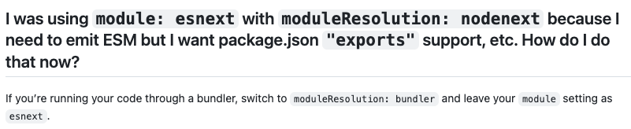

# Troubleshooting

### TypeScript integration can't find WeatherLayers Client typings

#### Issue

WeatherLayers Client typings are exported as a separate named export with `exports` syntax.

```typescript
  "exports": {
    ".": {
      "require": "./dist/weatherlayers-deck.min.cjs",
      "import": "./dist/weatherlayers-deck.min.js",
      "script": "./dist/weatherlayers-deck.umd.min.js",
      "types": "./dist/weatherlayers-deck.d.ts"
    },
    "./client": {
      "require": "./dist/weatherlayers-client.min.cjs",
      "import": "./dist/weatherlayers-client.min.js",
      "script": "./dist/weatherlayers-client.umd.min.js",
      "types": "./dist/weatherlayers-client.d.ts"
    }
  },
```

#### Symptoms

After WeatherLayers Client is imported with `import * as WeatherLayersClient from 'weatherlayers-gl/client'`, TypeScript reports that the module `weatherlayers-gl/client` can't be found and TypeScript integration doesn't work.

#### Solution

Check your `moduleResolution` in `tsconfig.json`.

Since TypeScript 5.0, there is a new value `bundler`, which allows covers exactly this case and should be compatible with modern development stacks.

Since TypeScript 5.2, this value is required.

See[ https://github.com/microsoft/TypeScript/pull/54567](https://github.com/microsoft/TypeScript/pull/54567) for details.

<figure><figcaption></figcaption></figure>
