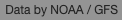

# Attribution Control

Attribution control shows the attribution for the data producer

### Example



```javascript
import * as WeatherLayers from '@weatherlayers/weatherlayers-gl';

// configure WeatherLayers Cloud client
WeatherLayers.setClientConfig({
  accessToken: 'xxx',
});

const attributionControl = new WeatherLayers.AttributionControl({
  dataset: ..., // string (STAC Collection ID)
});
```
