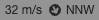

# Tooltip Control

Tooltip control shows the value (and the direction for vector datasets) at current mouse position on hovering the raster layer

### Example



```javascript
import * as WeatherLayers from '@weatherlayers/weatherlayers-gl';

// configure WeatherLayers Cloud client
WeatherLayers.setClientConfig({
  accessToken: 'xxx',
});

const tooltipControl = new WeatherLayers.TooltipControl({
  dataset: ..., // string (STAC Collection ID)
  deckgl: ..., // deck.gl instance
});
```
