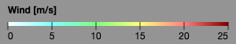

# Legend Control

Legend control shows the color legend for the raster layer

### Example



```javascript
import * as WeatherLayers from '@weatherlayers/weatherlayers-gl';

const legendControl = new WeatherLayers.LegendControl({
  title: 'Wind',
  unit: {
    unit: 'm/s',
  },
  palette: [
    [0, [255, 255, 255]],
    [5, [127, 255, 255]],
    [10, [127, 255, 127]],
    [15, [255, 255, 127]],
    [20, [255, 127, 127]],
    [25, [127, 0, 0]],
  ],
});
legendControl.addTo(document.getElementById('controls'));
```

### Constructor

#### `LegendControl(config: LegendConfig = {})`

### Config Properties

#### `width`

Type: number, optional

Default: 300

Width of the control.

#### `ticksCount`

Type: number, optional

Default: 6

Ticks to be displayed.

#### `title`

Type: string, required

Title to be displayed.

#### `unit`

Type: `StacRasterUnit = { unit: string; scale?: number; offset?: number; decimals?: number }`, required

Unit definition to be used for formatting numbers.

#### `palette`

Type: color palette text or array, required

Palette used to interpolate values to colors.

Formats:

* text (`string`) - see [Text format](https://github.com/weatherlayers/cpt2js#text-format) for details
* array (`[number, PaletteColor][]`) - `PaletteColor` is any object accepted by [Chroma.js constructor](https://vis4.net/chromajs/#chroma)

### Methods

See [Control methods](control-methods.md) common for all controls.
