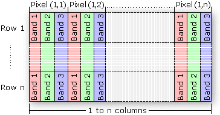

# Data

Data properties are common for all layers.

### Example

```javascript
import { Deck, COORDINATE_SYSTEM } from '@deck.gl/core';
import { ClipExtension } from '@deck.gl/extensions';
import * as WeatherLayers from '@weatherlayers/weatherlayers-gl';

// load custom self-hosted data
const image = { data: new Float32Array(...), width: ..., height: ... };

const deckgl = new Deck({
  layers: [
    new WeatherLayers.XxxLayer({
      // data properties
      image: image,
      bounds: [-180, -90, 180, 90],
    }),
  ],
});
```

### Example: GeoTIFF

```javascript
import { Deck, COORDINATE_SYSTEM } from '@deck.gl/core';
import { ClipExtension } from '@deck.gl/extensions';
import * as GeoTIFF from 'geotiff';
import * as WeatherLayers from '@weatherlayers/weatherlayers-gl';

async function loadGeotiff(url) {
  const geotiff = await GeoTIFF.fromUrl(url, { allowFullFile: true });
  const geotiffImage = await geotiff.getImage(0);

  const data = await geotiffImage.readRasters({ interleave: true });
  const nodata = geotiffImage.getGDALNoData();
  const maskedData = nodata != undefined ?
    new data.constructor(Array.from(data).map(value => value !== nodata ? value : NaN)) :
    data;

  const width = geotiffImage.getWidth();
  const height = geotiffImage.getHeight();

  const image = { data: maskedData, width, height };
  return image;
}

// load custom self-hosted data
const image = await loadGeoTiff(url);

const deckgl = new Deck({
  layers: [
    new WeatherLayers.XxxLayer({
      // data properties
      image: image,
      bounds: [-180, -90, 180, 90],
    }),
  ],
});
```

### Data properties

#### `image`

Type: object `{ data: TypedArray, width: number, height: number }`, required

Data type can be either Uint8 (`Uint8Array`, `Uint8ClampedArray`) or Float32 (`Float32Array`).

Data length must be `width * height * bandsCount`.

Supported bands count is `1` (scalar) or `2` (vector). See `imageType`.

For multi-band data, the expected format is that the band values are interleaved by pixel. For example, for vector data with `u`, `v` values, the expected format is `[u1, v1, u2, v2, ...]`. This is known as [BIP file format](https://desktop.arcgis.com/en/arcmap/latest/manage-data/raster-and-images/bip-format-example.htm).



#### `image2`

Type: object `{ data: TypedArray, width: number, height: number }`, optional

The subsequent data image. Used if `imageWeight > 0`.

See `image` for details.

#### `imageInterpolate`

Type: boolean, optional

Default: `true`

If on, the data for a particular lng/lat location are computed from the four nearest available pixels using bilinear interpolation (`GL.LINEAR`).

If off, the data for a particular lng/lat location are read from the nearest available pixel (`GL.NEAREST`).

#### `imageWeight`

Type: number `0-1`, optional

Default: `0`

Interpolation weight between `image` and `image2`.

#### `imageType`

Type: enum `WeatherLayers.ImageType`, values: `SCALAR`, `VECTOR`, optional

Default: `SCALAR` (for layers that support both scalar and vector data), `VECTOR` (for layers that support vector data only)

#### `imageUnscale`

Type: tuple of lower and upper bound `[number, number]`, optional

The original data value bounds, used to unscale the data if the original data are scaled (quantized).

Supported if the data type is Uint8.

#### `bounds`

Type: bounding box of minX, minY, maxX, maxY `[number, number, number, number]`, required

The original data bounding box. Recommended value is `[-180, -90, 180, 90]` for a global image.

#### `extensions`

Type: array of extensions

Use `[new ClipExtension()]` for a global image in an equirectangular projection on a [WebMercatorViewport](https://deck.gl/docs/api-reference/core/web-mercator-viewport), to clip the areas of the image beyond a valid Mercator bounding box. See [ClipExtension](https://deck.gl/docs/api-reference/extensions/clip-extension).

#### `clipBounds`

Type: bounding box of minX, minY, maxX, maxY `[number, number, number, number]`, required for `ClipExtension`

Recommended value is `[-181, -85.051129, 181, 85.051129]` for a global image in an equirectangular projection on a [WebMercatorViewport](https://deck.gl/docs/api-reference/core/web-mercator-viewport), to clip the areas of the image beyond a valid Mercator bounding box. There is `181` instead of `180` to avoid a pixel gap at the antimeridian. See [ClipExtension.clipBounds](https://deck.gl/docs/api-reference/extensions/clip-extension#clipbounds).
