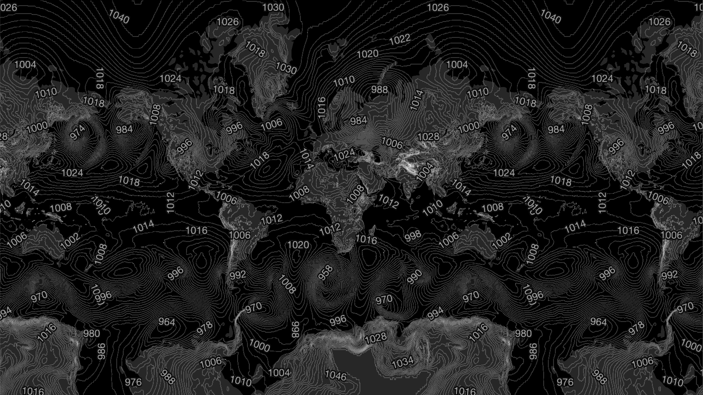

# Contour Layer

Variable rendered as contours

### Example



```javascript
import { Deck } from '@deck.gl/core';
import { ClipExtension } from '@deck.gl/extensions';
import * as WeatherLayers from '@weatherlayers/weatherlayers-gl';

// load custom self-hosted data
const image = { data: new Float32Array(...), width: ..., height: ... };

const deckgl = new Deck({
  layers: [
    new WeatherLayers.ContourLayer({
      id: 'contour',
      // data properties
      image: image,
      bounds: [-180, -90, 180, 90],
      extensions: [new ClipExtension()],
      clipBounds: [-181, -85.051129, 181, 85.051129],
      // style properties
      interval: 200,
    }),
  ],
});
```

### Data Properties

[Data properties](../data.md#data-properties) are common for all layers in the standalone bundle.

Float32 data are recommended for the best precision.

### Style Properties

#### `interval`

Type: number, required

Interval between contour lines in the data units. The greater interval, the less contour lines are rendered.

#### `width`

Type: `number`, optional

Default: `1`

Width of the major contour line (every fifth contour). See [LineLayer getWidth](https://deck.gl/docs/api-reference/layers/line-layer#getwidth).

Minor contour lines are rendered with half width.

#### `color`

Type: color `[number, number, number, number?]`, optional

Default: `[255, 255, 255, 51]`

Color of the major contour line (every fifth contour). See [LineLayer getColor](https://deck.gl/docs/api-reference/layers/line-layer#getcolor).

Minor contour lines are rendered with half alpha channel.

#### `opacity`

Type: number, optional

Default: `1`

Opacity of the layer. See [Layer opacity](https://deck.gl/docs/api-reference/core/layer#opacity).
