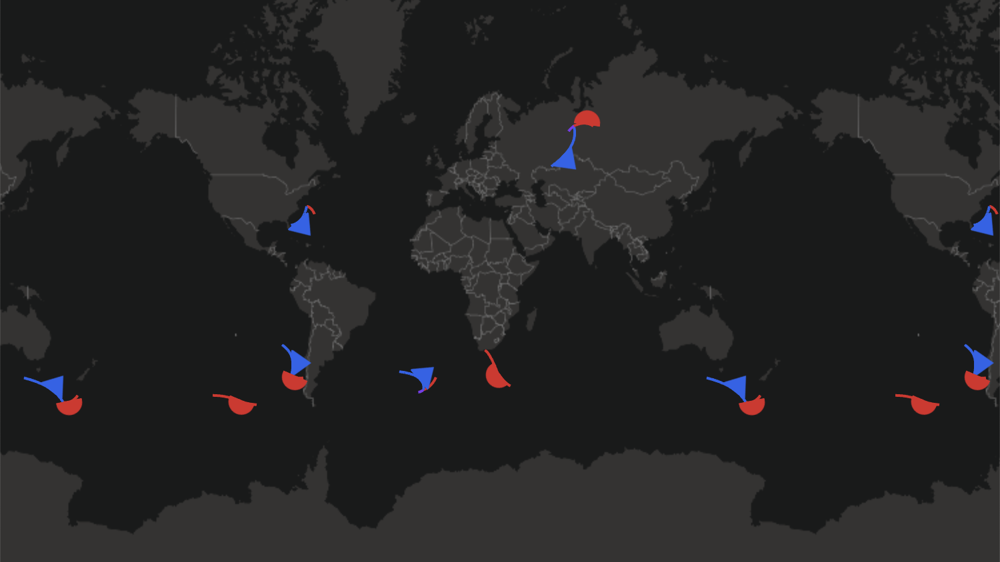

# Front Layer

Front data rendered as front lines with icons

### Example



```javascript
import { Deck } from '@deck.gl/core';
import WeatherLayers from 'weatherlayers-gl';

// load data
const frontData = [
  { type: WeatherLayers.FrontType.COLD, path: [...] },
  { type: WeatherLayers.FrontType.WARM, path: [...] },
  { type: WeatherLayers.FrontType.OCCLUDED, path: [...] },
  { type: WeatherLayers.FrontType.STATIONARY, path: [...] },
];

const deckgl = new Deck({
  layers: [
    new WeatherLayers.FrontLayer({
      id: 'front',
      // data properties
      data: frontData,
      getType: d => d.type,
      getPath: d => d.path,
    }),
  ],
});
```