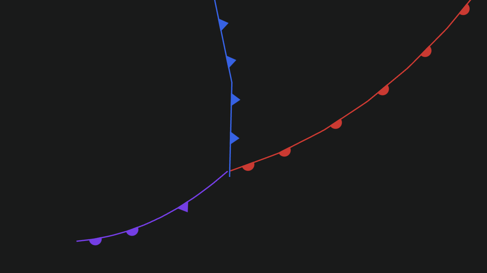
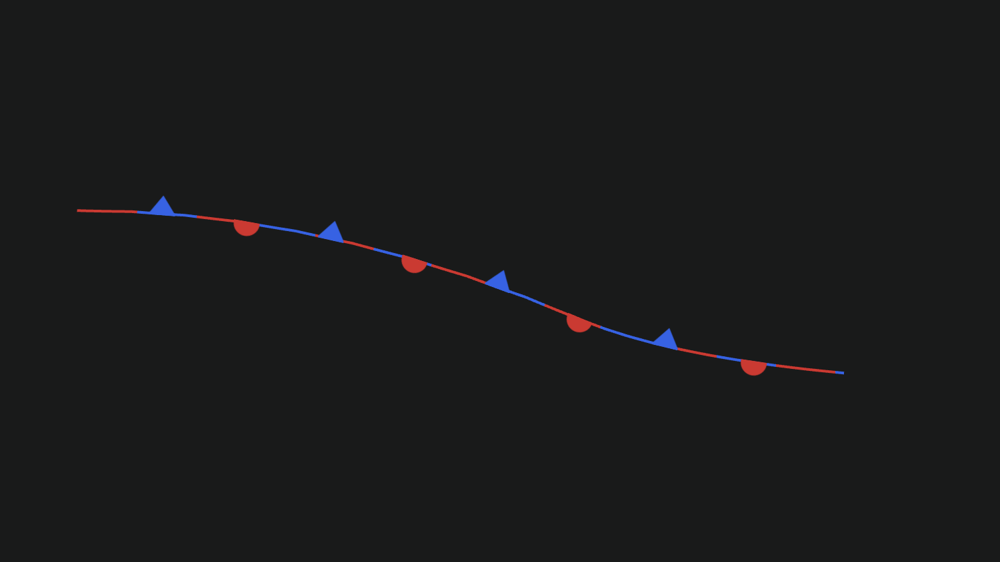

# Front Layer

Front data rendered as front lines with icons

### Example





```javascript
import { Deck } from '@deck.gl/core';
import * as WeatherLayers from 'weatherlayers-gl';

// load data
const frontData = [
  { type: WeatherLayers.FrontType.COLD, path: [...] },
  { type: WeatherLayers.FrontType.WARM, path: [...] },
  { type: WeatherLayers.FrontType.OCCLUDED, path: [...] },
  { type: WeatherLayers.FrontType.STATIONARY, path: [...] },
];

const deckgl = new Deck({
  layers: [
    new WeatherLayers.FrontLayer({
      id: 'front',
      // data properties
      data: frontData,
      // style properties
      getType: d => d.type,
      getPath: d => d.path,
      coldColor: [37, 99, 235], // Tailwind CSS blue-600
      warmColor: [220, 38, 38], // Tailwind CSS red-600
      occludedColor: [124, 58, 237], // Tailwind CSS violet-600
    }),
  ],
});
```

### Data Properties

#### `data`

Type: `DataT`

Array of data objects. See [Layer data](https://deck.gl/docs/api-reference/core/layer#data).

The data type can be any object. Specific fields should be accessed or mapped using accessors below

### Style Properties

#### `getType`

Type: `(d: DataT) => WeatherLayers.FrontType`

Accessor for the front type.

#### `getPath`

Type: `(d: DataT) => [number, number][]`

Accessor for the front path.

#### `width`

Type: `number`, optional

Default: 2

Width of the line. See [LineLayer getWidth](https://deck.gl/docs/api-reference/layers/line-layer#getwidth).

#### `coldColor`

Type: color `[number, number, number, number?]`, optional

Default: `[0, 0, 255]`

Color of the line and icon for cold fronts. See [LineLayer getColor](https://deck.gl/docs/api-reference/layers/line-layer#getcolor).

#### `warmColor`

Type: color `[number, number, number, number?]`, optional

Default: `[255, 0, 0]`

Color of the line and icon for warm fronts. See [LineLayer getColor](https://deck.gl/docs/api-reference/layers/line-layer#getcolor).

#### `occludedColor`

Type: color `[number, number, number, number?]`, optional

Default: `[148, 0, 211]`

Color of the line and icon for occluded fronts. See [LineLayer getColor](https://deck.gl/docs/api-reference/layers/line-layer#getcolor).
