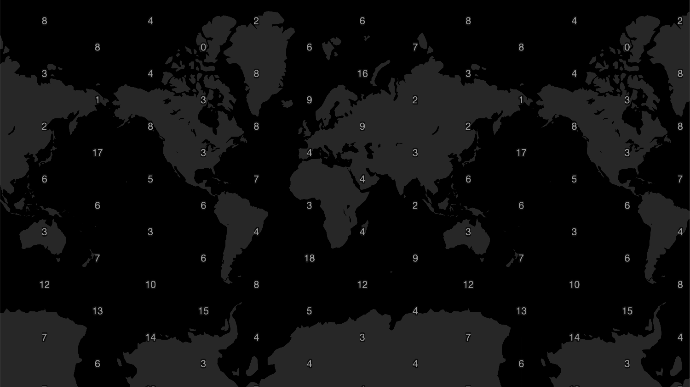
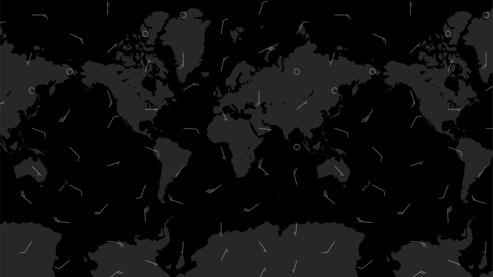

# Grid Layer

Variable rendered as grid of values or symbols (arrows, wind barbs)

### Example



```javascript
import { Deck } from '@deck.gl/core';
import * as WeatherLayers from '@weatherlayers/weatherlayers-gl';

// load data
const image = await WeatherLayers.loadTextureData(url);

const deckgl = new Deck({
  layers: [
    new WeatherLayers.GridLayer({
      id: 'grid',
      // data properties
      image: image,
      bounds: [-180, -90, 180, 90],
    }),
  ],
});
```

### Example: Arrows


```javascript
import { Deck } from '@deck.gl/core';
import * as WeatherLayers from '@weatherlayers/weatherlayers-gl';

// load data
const image = await WeatherLayers.loadTextureDataCached(url);

const deckgl = new Deck({
  layers: [
    new WeatherLayers.GridLayer({
      // data properties
      image: image,
      imageType: WeatherLayers.ImageType.VECTOR,
      bounds: [-180, -90, 180, 90],
      
      // style properties
      style: WeatherLayers.GridStyle.ARROW,
      iconBounds: [0, 100],
    }),
  ],
});
```

### Example: Wind Barbs



```javascript
import { Deck } from '@deck.gl/core';
import * as WeatherLayers from '@weatherlayers/weatherlayers-gl';

// load data
const image = await WeatherLayers.loadTextureDataCached(url);

const deckgl = new Deck({
  layers: [
    new WeatherLayers.GridLayer({
      // data properties
      image: image,
      imageType: WeatherLayers.ImageType.VECTOR,
      bounds: [-180, -90, 180, 90],
      
      // style properties
      style: WeatherLayers.GridStyle.WIND_BARB,
      iconBounds: [0, 100 * 0.51444], // 100 kts to m/s
    }),
  ],
});
```

### Data Properties

See [Data properties](data.md#data-properties) common for all layers.

### Style Properties

See [Style properties](style-properties.md) common for all layers.

#### `style`

Type: enum `WeatherLayers.GridStyle`, values: `VALUE`, `ARROW`, `WIND_BARB`, optional

Default: `VALUE`

Style of the grid points, values or symbols.

If `style: ARROW` or `style: WIND_BARB`, `imageType` must be `VECTOR`.

#### `unitFormat`

Type: `UnitFormat = { unit: string; scale?: number; offset?: number; decimals?: number }`, optional

Default: `null`

Unit definition to be used for formatting numbers.

#### `textFormatFunction`

Type: function `(value: number, unitFormat: UnitFormat) => string`, optional

Default: `(value, unitFormat) => unitFormat ? formatValue(value, unitFormat) : Math.round(value).toString()`

Function to format the value.

#### `textFontFamily`

Type: string, optional

Default: `"Helvetica Neue", Arial, Helvetica, sans-serif`

Font family of the text. See [TextLayer fontFamily](https://deck.gl/docs/api-reference/layers/text-layer#fontfamily).

#### `textSize`

Type: number, optional

Default: `12`

Size of the text. See [TextLayer getSize](https://deck.gl/docs/api-reference/layers/text-layer#getsize).

#### `textColor`

Type: color `[number, number, number, number?]`, optional

Default: `[153, 153, 153, 255]`

Color of the text. See [TextLayer getColor](https://deck.gl/docs/api-reference/layers/text-layer#getcolor).

#### `textOutlineWidth`

Type: number, optional

Default: `1`

Width of outline around the text, relative to the font size. See [TextLayer outlineWidth](https://deck.gl/docs/api-reference/layers/text-layer#outlinewidth).

#### `textOutlineColor`

Type: color `[number, number, number, number?]`, optional

Default: `[13, 13, 13, 255]`

Color of outline around the text. See [TextLayer outlineColor](https://deck.gl/docs/api-reference/layers/text-layer#outlinecolor).

#### `iconBounds`

Type: tuple of lower and upper bound `[number, number]`, required if `style` is `ARROW` or `WIND_BARB`

Bounds of the icon in the data units. The lower bound is usually 0, the upper bound is the largest value in the data units that matches the largest value of the icons.

If `style: WIND_BARB`, the upper bound must match 100 kts in the data units.

#### `iconSize`

Type: number, optional

Default: `12`

Size of the icon. See [IconLayer getSize](https://deck.gl/docs/api-reference/layers/icon-layer#getsize).

#### `iconColor`

Type: color `[number, number, number, number?]`, optional

Default: `[255, 255, 255, 102]`

Color of the icon. See [IconLayer getColor](https://deck.gl/docs/api-reference/layers/icon-layer#getcolor).
