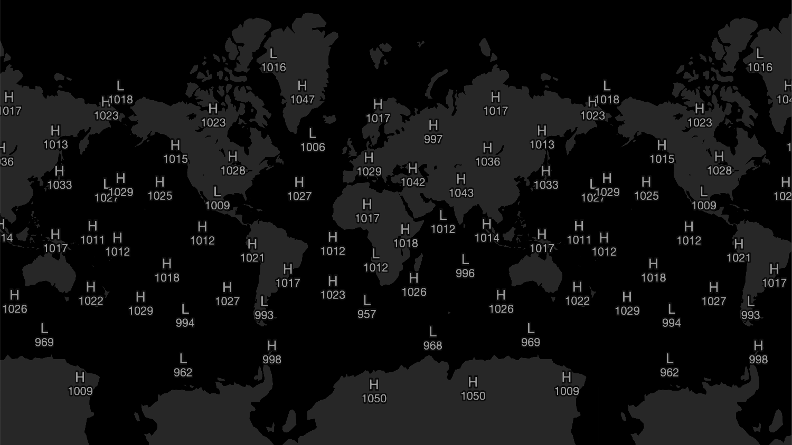

# HighLow Layer

Variable rendered as highs/lows

### Example



```javascript
import { Deck } from '@deck.gl/core';
import * as WeatherLayers from '@weatherlayers/weatherlayers-gl';

// load data
const image = { data: new Float32Array(...), width: ..., height: ... };

const deckgl = new Deck({
  layers: [
    new WeatherLayers.HighLowLayer({
      id: 'highLow',
      // data properties
      image: image,
      bounds: [-180, -90, 180, 90],
      // style properties
      radius: 1000, // km
    }),
  ],
});
```

### Data Properties

See [Data properties](data.md#data-properties) common for all layers.

### Style Properties

See [Style properties](style-properties.md) common for all layers.

#### `radius`

Type: number, required

Radius in km to filter nearby values. The greater radius, the less values are detected.

#### `textFormatFunction`

Type: function `(value: number) => string`, optional

Default: `(value) => Math.round(value).toString()`

Function to format the value.

#### `textFontFamily`

Type: string, optional

Default: `"Helvetica Neue", Arial, Helvetica, sans-serif`

Font family of the text. See [TextLayer fontFamily](https://deck.gl/docs/api-reference/layers/text-layer#fontfamily).

#### `textSize`

Type: number, optional

Default: `12`

Size of the text. See [TextLayer getSize](https://deck.gl/docs/api-reference/layers/text-layer#getsize).

#### `textColor`

Type: color `[number, number, number, number?]`, optional

Default: `[153, 153, 153, 255]`

Color of the text. See [TextLayer getColor](https://deck.gl/docs/api-reference/layers/text-layer#getcolor).

#### `textOutlineWidth`

Type: number, optional

Default: `1`

Width of outline around the text, relative to the font size. See [TextLayer outlineWidth](https://deck.gl/docs/api-reference/layers/text-layer#outlinewidth).

#### `textOutlineColor`

Type: color `[number, number, number, number?]`, optional

Default: `[13, 13, 13, 255]`

Color of outline around the text. See [TextLayer outlineColor](https://deck.gl/docs/api-reference/layers/text-layer#outlinecolor).
