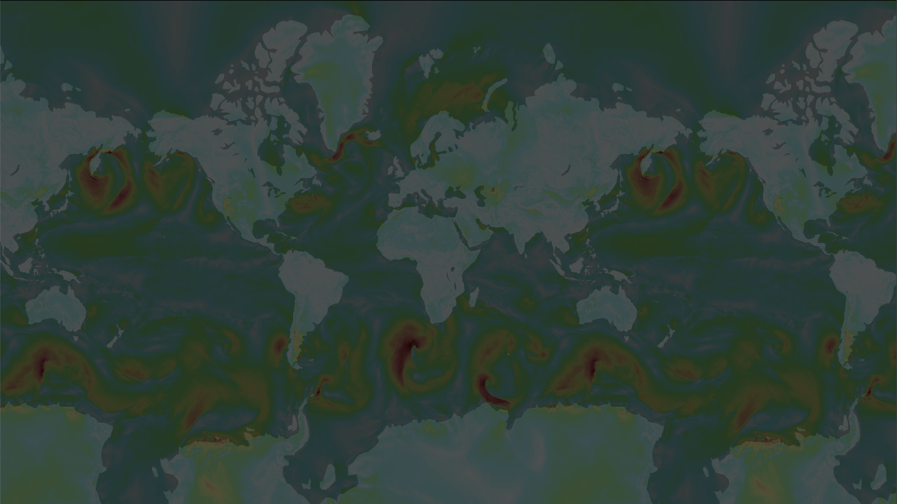

# Raster Layer

Variable rendered as a color overlay

### Example



```javascript
import { Deck, COORDINATE_SYSTEM } from '@deck.gl/core';
import { ClipExtension } from '@deck.gl/extensions';
import * as WeatherLayers from '@weatherlayers/weatherlayers-gl';

// load custom self-hosted data
const image = { data: new Float32Array(...), width: ..., height: ... };

const deckgl = new Deck({
  layers: [
    new WeatherLayers.RasterLayer({
      id: 'raster',
      // data properties
      image: image,
      bounds: [-180, -90, 180, 90],
      _imageCoordinateSystem: COORDINATE_SYSTEM.LNGLAT,
      extensions: [new ClipExtension()],
      clipBounds: [-181, -85.051129, 181, 85.051129],
      // style properties
      palette: [
        [0, [255, 255, 255],
        [5, [127, 255, 255],
        [10, [127, 255, 127],
        [15, [255, 255, 127],
        [20, [255, 127, 127],
        [25, [127, 0, 0],
      ],
    }),
  ],
});
```

### Example: Picking

```javascript
import { Deck, COORDINATE_SYSTEM } from '@deck.gl/core';
import { ClipExtension } from '@deck.gl/extensions';
import * as WeatherLayers from '@weatherlayers/weatherlayers-gl';

// load custom self-hosted data
const image = { data: new Float32Array(...), width: ..., height: ... };

const deckgl = new Deck({
  layers: [
    new WeatherLayers.RasterLayer({
      // data properties
      image: image,
      bounds: [-180, -90, 180, 90],
      _imageCoordinateSystem: COORDINATE_SYSTEM.LNGLAT,
      extensions: [new ClipExtension()],
      clipBounds: [-181, -85.051129, 181, 85.051129],
      // style properties
      palette: [
        [0, [255, 255, 255],
        [5, [127, 255, 255],
        [10, [127, 255, 127],
        [15, [255, 255, 127],
        [20, [255, 127, 127],
        [25, [127, 0, 0],
      ],
      pickable: true,
    }),
  ],
  onHover: event => console.log(event.raster),
});
```

### Data Properties

[Data properties](../data.md#data-properties) are common for all layers in the standalone bundle.

### Style Properties

#### `palette`

Type: color palette text or array, required

Palette used to interpolate values to colors.

Formats:

* text (`string`) - see [Text format](https://github.com/weatherlayers/cpt2js#text-format) for details
* array (`[number, PaletteColor][]`) - `PaletteColor` is any object accepted by [Chroma.js constructor](https://vis4.net/chromajs/#chroma)~~~~

#### `opacity`

Type: number, optional

Default: `1`

Opacity of the layer. See [Layer opacity](https://deck.gl/docs/api-reference/core/layer#opacity).

### Picking Info

If `pickable: true`, the picking info passed to callbacks (`onHover`, `onClick`, etc.) provides information on which pixel was picked. It contains an additional `raster` field.

Float32 data are recommended for the best precision.

See [BitmapLayer Pixel Picking](https://deck.gl/docs/api-reference/layers/bitmap-layer#pixel-picking).

#### `value`

Type: number, required

Value at the pixel.

#### `direction`

Type: number, optional

Direction at the pixel. Supported for vector data.
