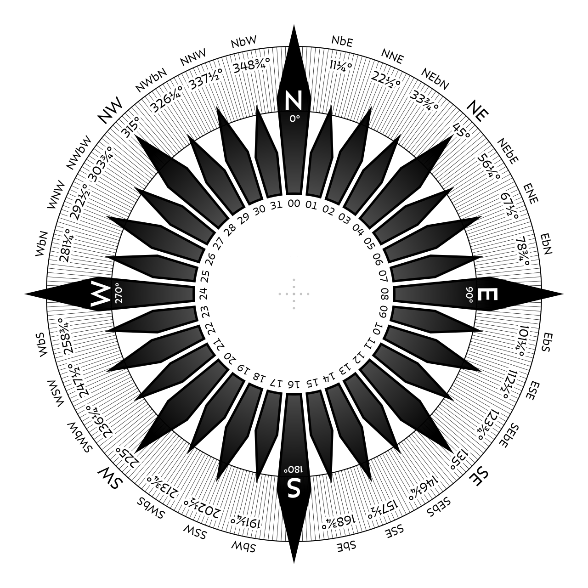

# Types

### Image Types

#### `ImageInterpolation`

```typescript
enum ImageInterpolation {
  NEAREST = 'NEAREST',
  LINEAR = 'LINEAR',
  CUBIC = 'CUBIC',
}
```

Image interpolation method.

* `NEAREST` - no interpolation, fastest
* `LINEAR` - medium interpolation quality
* `CUBIC` - best interpolation quality, slowest

#### `ImageType`

```typescript
enum ImageType {
  SCALAR = 'SCALAR',
  VECTOR = 'VECTOR',
}
```

Image type.

* `SCALAR` - contains a single variable
* `VECTOR` - contains two variables, `u` and `v` vector components

#### `ImageUnscale`

```typescript
type ImageUnscale = [min: number, max: number] | null;
```

Value bounds to unscale image data to original data, or null if image contains original data already and no unscaling is needed.

#### `ImageProperties`

```typescript
interface ImageProperties {
  image: TextureData;
  image2: TextureData | null;
  imageSmoothing: number;
  imageInterpolation: ImageInterpolation;
  imageWeight: number;
  imageType: ImageType;
  imageUnscale: ImageUnscale;
  imageMinValue: number | null;
  imageMaxValue: number | null;
}
```

Properties to render a single image.

#### `DirectionFormat`

```typescript
enum DirectionFormat {
  VALUE = 'VALUE',
  CARDINAL = 'CARDINAL',
  CARDINAL2 = 'CARDINAL2',
  CARDINAL3 = 'CARDINAL3',
}
```

Direction format to be used for formatting.

* `VALUE` - formats direction as a value in degrees
* `CARDINAL` - formats direction as a 1-letter cardinal (4 possible values)
  * N, E, S, W
* `CARDINAL2` - formats direction as a 2-letter cardinal (8 possible values)
  * N, NE, E, SE, S, SW, W, NW
* `CARDINAL3` - formats direction as a 3-letter cardinal (16 possible values)
  * N, NNE, NE, ENE, E, ESE, SE, SSE, S, SSW, SW, WSW, W, WNW, NW, NNW



#### `Placement`

```typescript
enum Placement {
  BOTTOM = 'BOTTOM',
  TOP = 'TOP',
  RIGHT = 'RIGHT',
  LEFT = 'LEFT',
}
```

Tooltip control placement from the mouse cursor position.

### Load Types

#### `TextureData`

```typescript
interface TextureData {
  data: Uint8Array | Uint8ClampedArray | Float32Array;
  width: number;
  height: number;
}
```

Texture data to be used as input to raster rendering layers.

#### `UnitFormat`

```typescript
interface UnitFormat {
  unit: string;
  scale?: number;
  offset?: number;
  decimals?: number;
}
```

Format definition to be used for formatting raw values with units.

#### `RasterPointProperties`

```typescript
interface RasterPointProperties {
  value: number;
  direction?: number;
}
```

Raster point properties for a particular position.

### Datetime Types

#### `DatetimeISOString`

```typescript
type DatetimeISOString = string;
```

Valid ISO 8601 datetime.

#### `DatetimeISOStringRange`

```typescript
type DatetimeISOStringRange = [start: DatetimeISOString, end: DatetimeISOString];
```

Valid ISO 8601 datetime range.
